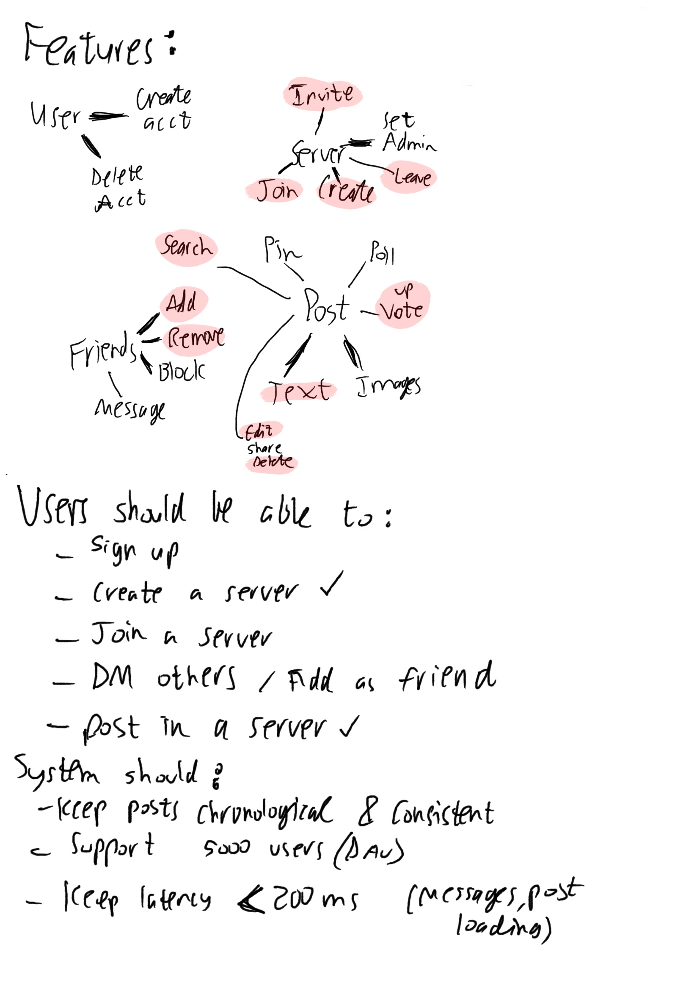
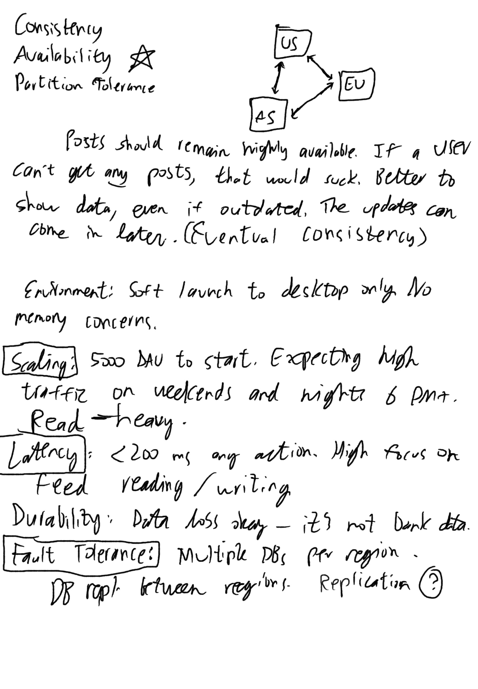
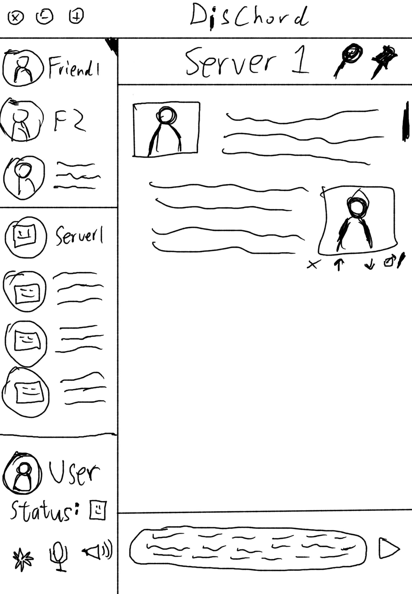
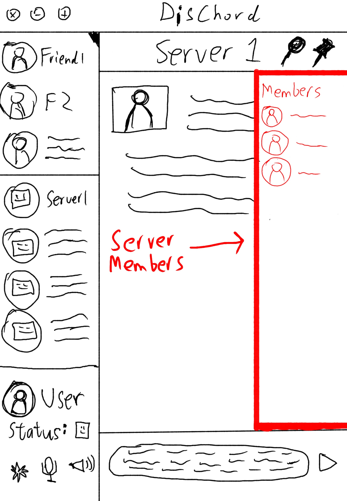
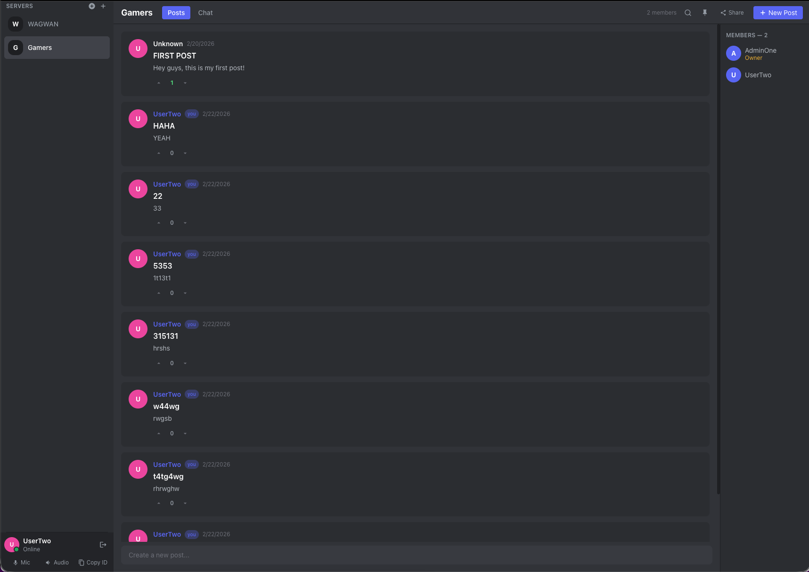

# Dischord — Progress Journal

> A Discord-like forum and chat app built with Go and React.

---

## Initial Design

### Features



The initial feature map laid out the full scope of what Dischord should support:

- **Users** — create and delete accounts
- **Servers** — create, join, invite others, set admins, leave
- **Posts** — text and image posts with edit/delete/share, search, pin, poll, and upvote
- **Friends** — add, remove, block, and direct message

The bottom half of the sketch captured formal requirements:

**User requirements:**
- Sign up
- Create a server ✅
- Join a server
- DM others / add as friend
- Post in a server ✅

**System requirements:**
- Keep posts chronological and consistent
- Support 5,000 DAU
- Keep latency < 200 ms (messages, post loading)

---

### System Design



The system design sketch worked through CAP theorem trade-offs and settled on **Availability** as the priority (starred). The rationale: posts should remain highly available — better to show slightly outdated data than nothing at all (eventual consistency).

Key non-functional decisions:
- **Environment:** Desktop-only soft launch
- **Scaling:** 5,000 DAU, high traffic on weekends and evenings (6 PM+), read-heavy
- **Latency:** < 200 ms for any action; high focus on feed reading/writing
- **Durability:** Data loss acceptable — "it's not bank data"
- **Fault Tolerance:** Multiple DBs per region, DB replication between regions (US / EU / AS)

---

### Database Schema


The initial schema sketch identified three core tables:

| Table | Key columns |
|---|---|
| **POST** | post_id (PK), author (FK), timestamp, content, server_id (FK), votes |
| **USER** | user_id (PK), friends, servers |
| **SERVER** | server_name (PK), posts, members, admin (FK) |

**How it evolved:** The implemented schema refined this significantly — `server_name` as a PK was replaced with a random hex ID, `friends` and `servers` became their own join tables (`friends`, server membership implied by `server_ids` on users), and a separate `votes` table was added with a composite `(post_id, author_id)` PK.

Final implemented schema:

| Table | Key columns |
|---|---|
| users | id, username, email |
| servers | id, name, owner_id |
| posts | id, server_id, author_id, title, body |
| votes | (post_id, author_id) PK, vote INT |
| friends | (user_id, friend_id) PK — bidirectional rows |
| messages | id, server_id, author_id, content |

---

### Data Flow


The data flow diagram sketched a microservice-style architecture with an API Gateway routing to separate Server Service and Post Service, each with dedicated databases, plus a User Service writing to a Users DB.

**How it evolved:** The implemented architecture is a single monolith — one Go HTTP server handles all routes, backed by a single Postgres database. Appropriate for the current scale target; the sketch provided a north star for future decomposition.

---

### REST API Design


The initial API sketch defined three core entities (User, Post, Server) and the following endpoints:

```
POST   /v1/server                       — create server
DELETE /v1/server/{server_name}
GET    /v1/server/{name}
POST   /v1/server/{name}                — create post
PUT    /v1/server/{name}/{post_id}      — edit post
DELETE /v1/server/{name}/{post_id}
POST   /v1/user/:id                     — send message (body: { message: string })
```

**How it evolved:** The final API closely follows this structure, but routes use random IDs instead of names, a friends sub-resource was added, votes got dedicated endpoints, and the path scheme became `/servers/{sid}/posts/{id}` for proper nesting.

Final implemented routes:

| Method | Path |
|---|---|
| POST / GET | `/users`, `/users/{id}` |
| POST / GET | `/users/{id}/friends` |
| POST / GET | `/servers`, `/servers/{id}` |
| POST / GET / PUT / DELETE | `/servers/{sid}/posts`, `/servers/{sid}/posts/{id}` |
| POST / GET | `/servers/{sid}/messages` |
| GET / PUT | `/servers/{sid}/posts/{id}/vote` |

---

### UI Wireframes

**Iteration 1 — initial layout**



The first wireframe established the two-panel Discord-inspired layout:
- **Left sidebar:** friends list at top, servers list in the middle, user panel at the bottom (with status, mic, and audio controls)
- **Main panel:** server header (with search and settings icons), post feed (each post shows author avatar, content body, and action icons — delete, upvote, downvote, edit)

**Iteration 2 — annotated revisions**


The second pass crossed out friends from the top of the sidebar (simplifying the left panel) and annotated the key areas in green:
- **Server info bar** — the header area showing server name and controls
- **Message bar** — the input bar at the bottom for composing posts/messages

**Iteration 3 — members panel**



The third iteration added a right-side **Server Members** panel — a list of member avatars and names anchored to the right edge, consistent with Discord's layout.

---

## Current State (WIP)




The app is functional. Here's what's been built:

### Backend (Go)
- Full REST API on `:8080` using Go stdlib `net/http` (no framework)
- PostgreSQL store with `lib/pq`; schema applied automatically on startup via `ApplySchema()`
- Handler tests + integration tests using a separate `dischord_test` database

### Frontend (React + TypeScript + Tailwind)
- Dark Discord-style theme
- **Login flow:** create a new user or paste an existing user ID
- **Sidebar:** servers list with add/join by ID; user panel at bottom with Mic / Audio / Copy ID
- **ServerView:** Posts tab (forum-style thread feed) and Chat tab (messages)
- **PostCard:** displays author, timestamp, title, body, and a vote strip (▲ aggregate ▼)
  - Own posts show edit/delete controls on hover
  - Vote toggle: clicking the active vote sends 0 (cancel); switching sends the new value
- **Members panel:** right-side list of server members, owner labelled

### What's still to do (from original feature list)
- [ ] Join server by invite (currently: paste ID directly)
- [ ] DM friends / add friends from within the UI
- [ ] Image post support
- [ ] Pin posts
- [ ] Polls
- [ ] Server admin management
